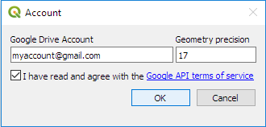
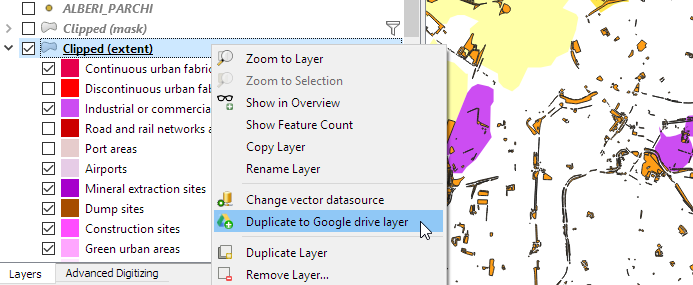
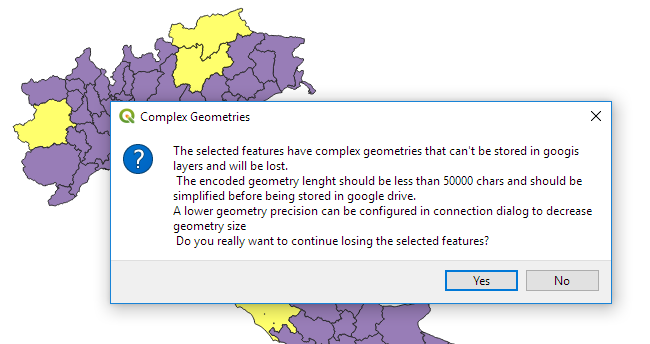
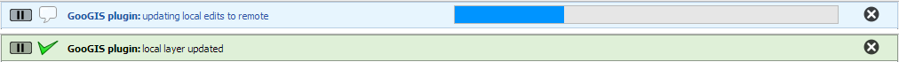
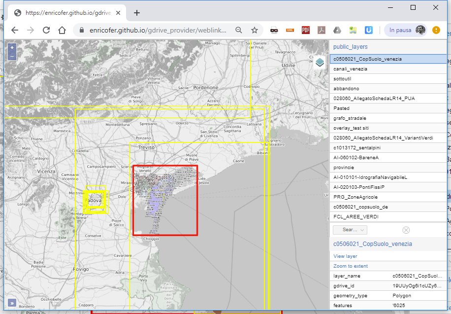

# GooGIS

#### a Google Drive data provider for QGIS

## 1. About the plugin

GooGIS is an experimental QGIS plugin that originates from [pseudo_csv_provider](http://github.com/g-sherman/pseudo_csv_provider) by @g-sherman. It keeps syncronization between a local memory layer and a remote google drive sheet and provides a simple peer to peer cloud environment for sharing and editing geospatial vector contents with other users, handling conflicts between concurrent users editings. It's only required a valid Google account.

### How it works

The QGIS layer data structure (geometry and attributes) is stored in a remote Google Spreadsheet. The plugin manages read/write rights on the layer, tracks concurrent data access and editing, and syncronizes local and remote table on start/end editing. 
Many users are allowed to concurrently view and modify spatial data in the same time without taking care of conflicts. 

### Requirements

All needed dependencies come with the plugin:

- googleapiclient (C)Google
- oauth2client (C)Google
- bridgestyle (C)GeoCat bv @volaya
- ol-mapbox-style (C)various contributors @ahocevar

### Installation
Waiting for official repository submitting It's possible to clone  or download the plugin code from github: https://github.com/enricofer/gdrive_provider/archive/master.zip
Avoid installing it directly from QGIS "install from zip" utility. It will throws external libraries exception. Download, unzip and Install directly in profile plugin directory carefully renaming the folder to "gdrive_provider" if different named.

## 2. Connect to Google Drive

Once installed, the Plugin Icon appears in QGIS toolbar. At the first plugin run, a valid google accout (username@domain) is asked and a Google OAuth2 session started on the predefined browser to authenticate the user and grant to GooGIS application the needed API rights. When the Authentication Flow successfully ended we can come back and continue working on QGIS main application.
Now clicking on plugin icon the main dialog appears showing the available GooGIS layers. If the provided user never has never accessed before the layers list is empty and some local data have to be exported to remote for sharing.

## 3. Export a QGIS layer to Google drive

First load and give style to a regular qgis layer then export it to GooGIS clicking on "Export to GDrive" button on the main dialog or right clicking on layer menu item and "Duplicate to Google Drive Layer".
The local layer is converted and exported to a remote layer. Exporting has some limitations: Google drives can store max 400000 cells and max 50000 bytes for a single cell. Large layers with complex geometries could not be correctly exported to gdrive. In this case it is possible to decrease geometry precision default in account connection dialog to minimize the gdrive space required for storing features.

GooGIS use 3 cell per feature to store geometry, feature id and status plus a cell per attribute. A 40000 feature layer with a 7 fields attribute table actually reaches the limit (40000 * (3+7)). 
Once exported, the layer is Duplicated in Layer Panel, appears in Available GooGIS layers in main Dialog and the current user become layer owner

Note: Layers are exported together with associated style. The layer appears the same for any user then opens it

## 4. Sharing data

Clicking on Layers list on the left of dialog window, the selected item details appear on the right side of dialog. 
In the panel are visible general informations about the layer(name, owner, id, capabilities) and a user rights panel
The layer owner can insert a space separated list of users in the read/write or read only text box and clicking on "update permissions" the layer permissions are updated accordingly.
Furthermore the layer can be make public checking "anyone can read/write" or "anyone can read" widget and updating permissions. 

Managing Permission is only available to Layer owner. Once shared the layer become automatically available to specificated users and will appear their GooGIS main dialog.

## 5. Sync data edits

To load a layer in QGIS canvas, double click on available layer list or select it and then click "OK" button

The layer imported from Google drive can now be viewed if we have read capabilities or edited if we have read/write capabilities on it.
For the read-only layers editing will fail and rollback to original state. But it's possible to sync them with remote layer right clicking on layer item in layer panel and then to "sync to Google Drive". Modification occured in remote Layer will be loaded in local Layer.
Read/write layers can be normally edited as regular QGIS layers. All editing tools for geometry, attributes or fields can be used without any limitation.
When we start editing session for a GooGIS layer the plugin checks first for remote modification and eventually syncs local with remote and then starts editing mode.
Once editing started the edited features are marked as locked in remote table to prevent other users edits on them and so preventing data losses. 
Locking acts at row level, so other users are free to edit other features without conflicting with current editing session.
When editing ends local features mods are writed to remote and edited features are freed of applied locks

The local/remote read/write activity is reported on QGIS message bar

## 6. Public layers

When a layer is set readable to anyone become public and can be shared between any user. Public layers main metadata are stored in a public sheet accessible by plugin to allow all users to browse and retrieve them clicking on "import public layers" button. Available public layers list can be filtered by name or gdrive id and multiple layers can be imported at once to become visible in the available layers list. Public layers are marked with a "world icon" and user shared layer are marked with a "group icon"

The loaded GooGIS layers can be saved in QGIS projects as ordinary QGIS layers. With The GooGIS plugin installed they will be loaded on the fly opening the project.

## 7. Weblinks

Selected public layers can be viewed as openlayers vector layers, clicking on "browse weblinks" button. The provided link can be publicy shared without any user authentication.
The webapp loads the layers dynamically from google sheets and render them on openlayers. The layers are specified by google id, separated by commas, with in url parametes ?spreadsheet_id: https://enricofer.github.io/gdrive_provider/weblink/converter.html?spreadsheet_id=19UUyOg6i1cUZy6Q9S0c7_SJ5IcuH4lBFo1AY92_Q5pY,1yPAqNQLAGBmATT8j3VQV64Xw0lEkjtirD5qsh687YgM,15zmg1f36uEdHZNDOnSXrDtXPFtAYq8Ax7rw82WnB3Bo
The mosaic of published Public layers at the following page: https://enricofer.github.io/gdrive_provider/weblink/mapper.html

